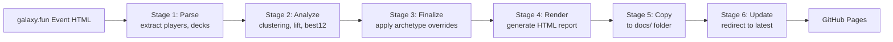

# Galaxy Stats

Meta analysis reports for "Once Upon a Galaxy" tournaments

## Quick Start

```bash
# Install Python dependencies
make install

# Download event HTML from galaxy.fun and save to etl/context/
# Then generate full report (all 5 steps: parse → analyze → render → copy → update)
make report HTML_FILE=context/2026-03.html EVENT_ID=2026-03
```

## Architecture

Galaxy Stats generates standalone HTML reports through a **6-stage ETL pipeline**:



### Directory Structure

```
galaxy-stats/
├── etl/                    # Python ETL pipeline
│   ├── scripts/
│   │   ├── parse_event.py      # Step 1: Parse HTML → JSON
│   │   ├── analyze_event.py    # Step 2: Analyze JSON (clustering, lift, best12)
│   │   └── render_report.py    # Step 3: Render HTML from analysis
│   ├── context/               # Source HTML files from galaxy.fun
│   └── dist/                  # Intermediate analysis + final report
├── docs/                   # Static HTML reports (served by GitHub Pages)
└── Makefile               # Build automation
```

## Workflow

### Full Workflow (All 6 Steps)

```bash
make report HTML_FILE=context/2026-03.html EVENT_ID=2026-03
```

This runs:
1. **Parse** → Extracts players, captains, decks from event HTML
2. **Analyze** → Calculates clusters, lift, and best12 per captain
3. **Finalize** → Applies archetype overrides from config (optional: use `make report-auto` to skip)
4. **Render** → Generates standalone HTML report
5. **Copy** → Moves report to `docs/reports/<event-id>/`
6. **Update** → Updates root `docs/index.html` redirect

**Two workflow options:**
- `make report` — Uses archetype overrides (recommended for production)
- `make report-auto` — Skips overrides, uses auto-generated cluster labels

### Individual Steps (for debugging)

```bash
make etl-parse    HTML_FILE=context/2026-03.html EVENT_ID=2026-03
make etl-analyze  EVENT_ID=2026-03
make etl-finalize-with-overrides EVENT_ID=2026-03  # or: make etl-finalize (no overrides)
make etl-render   EVENT_ID=2026-03
make copy-report  EVENT_ID=2026-03
make update-latest EVENT_ID=2026-03
```

## Development

### Python Tooling

```bash
make install     # Install Python dependencies (numpy, scipy, beautifulsoup4)
make lint        # Run linter and formatter
make format      # Format code
make clean       # Remove virtual environment
make help        # Show all available commands
```

### Adding Dependencies

```bash
# From the etl/ directory
uv add <package>           # Runtime dependency
uv add <package> --dev     # Development dependency
```

### Working Directly in etl/

```bash
cd etl
uv run scripts/parse_event.py context/2026-03.html 2026-03
uv run scripts/analyze_event.py 2026-03
uv run scripts/render_report.py 2026-03
```

## Report Structure

Each report is a **single, self-contained HTML file** with:
- **Embedded CSS**: Dark theme with custom typography (Playfair Display, IBM Plex)
- **Embedded JSON**: Tournament data in a `DATA` constant
- **Interactive JavaScript**: Tab navigation, animated charts, toggle views
- **No external dependencies**: Works offline, no build step required

Report sections:
- **Top Cards**: Bar chart showing card popularity across all winning decks
- **Card Archetypes**: Clustered cards (Treasures, Candy, Mage, Pirates, Animals, Fringe)
- **Captain Analysis**: Signature cards (lift) and best 12 picks per captain

## Archetype Configuration

The `etl/config/archetypes.json` file defines **archetype overrides** that map card slugs to specific archetypes. This is useful when:

- Auto-generated cluster labels don't match domain knowledge
- Certain cards belong in specific archetypes regardless of clustering
- You want consistent archetype names across events

**Structure:**
```json
{
  "card_slug_here": {
    "archetype": "Treasures",
    "color": "#c8a96e"
  }
}
```

**How it works:**
1. During analysis, cards are auto-clustered into groups
2. During finalize, cards in `archetypes.json` are reassigned to specified archetypes
3. Reports show the overridden archetypes with player decklists

**When to edit:**
- Before running `make report` for a new event
- Review auto-generated clusters first (in `etl/dist/events/<event-id>-auto-analysis.json`)
- Add overrides for cards that should be in different archetypes

## Adding New Reports

1. **Download event HTML** from galaxy.fun → save to `etl/context/2026-04.html`
2. **Generate report**: `make report HTML_FILE=context/2026-04.html EVENT_ID=2026-04`
   - Uses archetype overrides from `etl/config/archetypes.json`
   - Or use `make report-auto` to skip overrides
3. **Verify locally**: Open `docs/reports/2026-04/index.html` in browser
4. **Review archetypes** (optional):
   - Check auto-generated clusters in `etl/dist/events/2026-04-auto-analysis.json`
   - Update `etl/config/archetypes.json` if needed
   - Re-run: `make etl-finalize-with-overrides EVENT_ID=2026-04` → `make etl-render` → `make copy-report`
5. **Commit and push**: GitHub Pages will auto-deploy

## Troubleshooting

**Wrong HTML path error**: Use `HTML_FILE=context/2026-03.html` (relative to etl/), NOT `etl/context/2026-03.html`

**Cluster names don't make sense**: Edit labels in `etl/dist/events/<event-id>-analysis.json` and re-run `make etl-render`

**Report renders with no CSS**: Check `render_report.py` template uses single braces `{` for CSS/JS

**Wrong event data**: Delete `etl/dist/events/<event-id>-analysis.json` and re-run `make etl-analyze`
